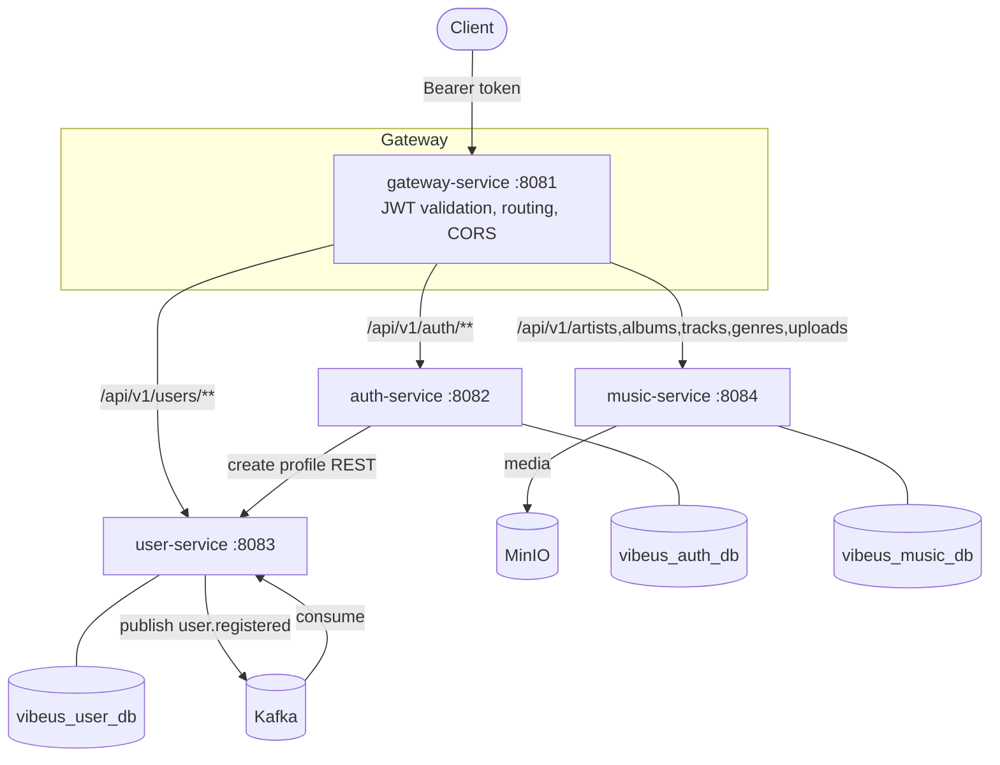

# VibeUs

Hands-on music streaming **backend** built as microservices: API gateway, auth, user profiles, and music catalog with MinIO uploads and Kafka events.

## Architecture



The gateway is the single auth enforcement point: it validates the access token,
strips `Authorization`, and forwards identity via `X-User-*` headers. See the
[architecture docs](docs/architecture/) and [ADRs](docs/architecture/decisions/).

## Tech stack

- **Language/Runtime**: Java 21
- **Framework**: Spring Boot 3.5, Spring Cloud Gateway
- **Security**: Stateless JWT (JJWT), BCrypt
- **Persistence**: PostgreSQL, Spring Data JPA/Hibernate
- **Messaging**: Apache Kafka (Spring Kafka)
- **Object storage**: MinIO (S3-compatible)
- **Service-to-service**: REST + OpenFeign
- **Build/Test**: Maven, JUnit 5, Mockito, H2 (tests)
- **Local infra**: Docker Compose; **CI**: GitHub Actions

## Repository layout

```
docs/                 Vision, requirements, architecture, ADRs, API, operations
infrastructure/       Docker Compose (Postgres, Redis, MinIO, Kafka, Kafka UI)
gateway-service/      Port 8081
auth-service/         Port 8082
user-service/         Port 8083
music-service/        Port 8084
playlist-service/     Planned (placeholder)
search-service/       Planned (placeholder)
streaming-service/    Planned (placeholder)
```

## Ports

### Application services

| Service | Port | Health |
|---------|------|--------|
| gateway-service | **8081** | http://localhost:8081/actuator/health |
| auth-service | **8082** | http://localhost:8082/actuator/health |
| user-service | **8083** | http://localhost:8083/actuator/health |
| music-service | **8084** | http://localhost:8084/actuator/health |

**API entry point:** http://localhost:8081

### Infrastructure

| Component | Host port(s) | UI / notes |
|-----------|--------------|------------|
| PostgreSQL | **5433** | Databases: `vibeus_auth_db`, `vibeus_user_db`, `vibeus_music_db` |
| Redis | **6379** | Provisioned; unused by app code in MVP |
| MinIO | **9000**, **9001** | API + console (http://localhost:9001) |
| Kafka | **9092** | Host bootstrap for Spring apps |
| Kafka UI | **8080** | http://localhost:8080 |

## Local setup

### 1. Start infrastructure

```bash
cd infrastructure
cp .env.example .env   # optional
docker compose up -d
docker compose ps
```

Full runbook: [infrastructure/README.md](infrastructure/README.md)

### 2. Start services

Recommended order: auth → user → music → gateway.

```bash
cd auth-service && ./mvnw spring-boot:run
cd user-service && ./mvnw spring-boot:run
cd music-service && ./mvnw spring-boot:run
cd gateway-service && ./mvnw spring-boot:run
```

Requires **Java 21** and Maven Wrapper (included per service).

## Documentation

| Area | Path |
|------|------|
| Vision & learning goals | [docs/](docs/) |
| Requirements & MVP scope | [docs/requirements/](docs/requirements/) |
| Architecture & stack | [docs/architecture/](docs/architecture/) |
| Architecture decisions (ADRs) | [docs/architecture/decisions/](docs/architecture/decisions/) |
| API reference | [docs/api/api-reference.md](docs/api/api-reference.md) |
| Event catalog | [docs/events/event-catalog.md](docs/events/event-catalog.md) |
| Runbook | [docs/operations/runbook.md](docs/operations/runbook.md) |
| Security review | [docs/operations/security-review.md](docs/operations/security-review.md) |
| Roadmap & planned services | [docs/roadmap/](docs/roadmap/) |
| Lessons learned | [docs/lessons-learned.md](docs/lessons-learned.md) |
| Local infrastructure | [infrastructure/README.md](infrastructure/README.md) |

## Build & test

Each service builds independently with the Maven Wrapper:

```bash
cd <service> && ./mvnw verify
```

CI runs the same per-service build on every push and pull request
([.github/workflows/ci.yml](.github/workflows/ci.yml)).

## License

MIT — see [LICENSE](LICENSE)
